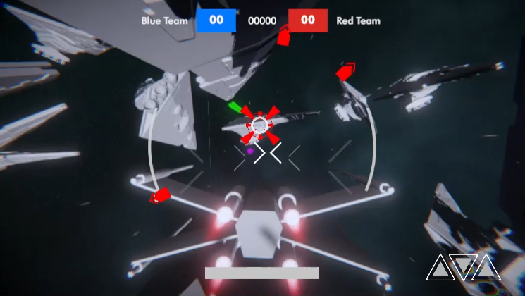
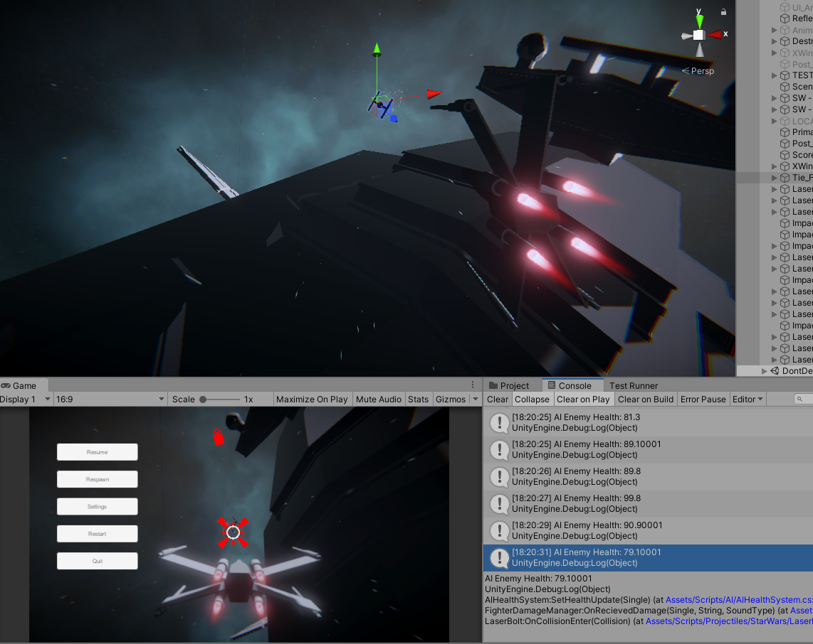
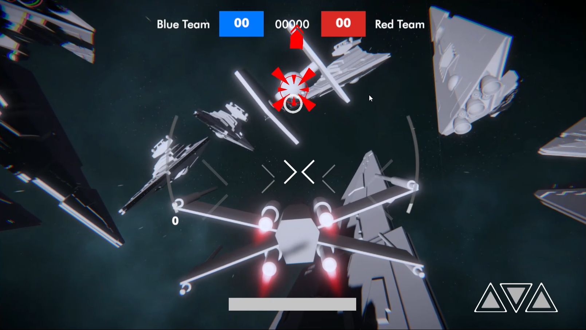
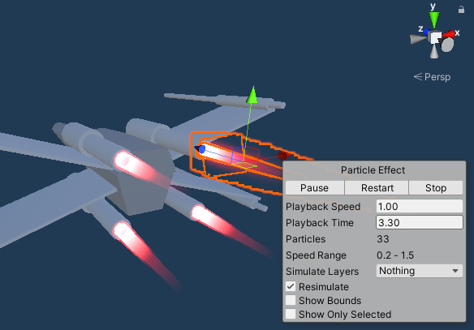

# Universe-Collides



Universe Collides is a personal game which I began development on its first initial version back in early 2020. However over the course of several weeks,
the development has shifted into a newer version using 2019.4.0f1 as its platform version for unity. Since then much of the development
has been focused on much of the functionality of the gameplay but also as a learning tool into general software development. Ever since its 
early development the game was created utilising legacy tools and no coherance to software design and architecture. However, it has been improved
with the clarity of design principles such as S.O.L.I.D	and many more.

As of 2021 development has been halted so that more focus is given to learning web and mobile dev, alongside my personal game "Evacuation" and
other graphics based project throughout the current year.







### Prerequisites

What things you need to install the software and how to install them

```
* Unity 2019.4.0f1
```

## Built With

* [Unity](https://unity.com/) - Link to Unity Technologies page

<!-- CONTACT -->
## Contact

Twitter - [@ChicoteJaiden](https://twitter.com/ChicoteJaiden)
Instagram - [@mr_i_art](https://www.instagram.com/mr_i_art/)
Itch.io - (https://jaidenchicote.itch.io/)

## License

No license is applied to this repository

## Acknowledgments

* Hat tip to anyone whose code was used
* Inspiration
* etc
